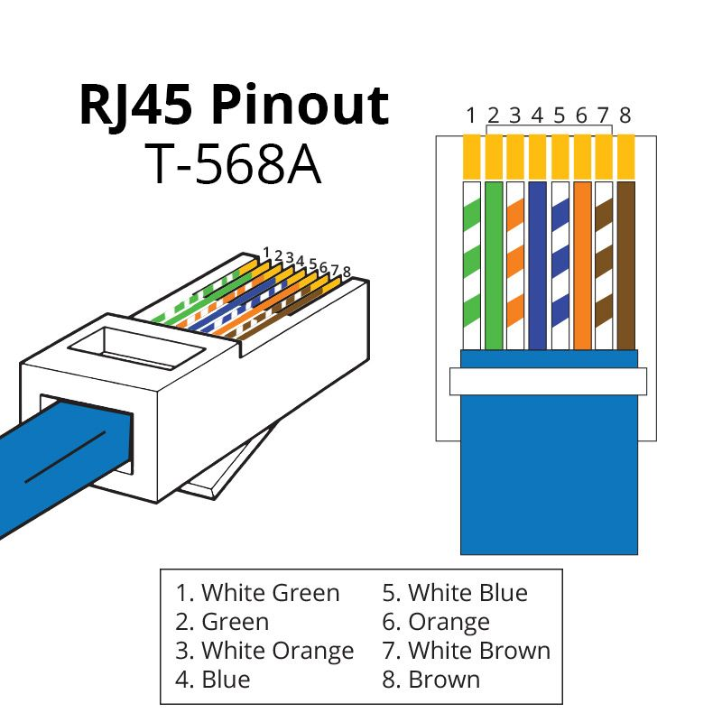

# AIMS MPPT Solar Charger Library

This Arduino library provides a simple interface for communicating with AIMS MPPT solar charge controllers over UART.

## Overview

- Reads controller measurements such as PV voltage, battery voltage, charging current, power, and temperatures.
- Reads device information and calibration data.
- Supports common configuration actions such as setting battery type, charge current, and machine address.
- Includes ready-to-run examples for reading data and writing settings.

## Wiring
The wiring for the AIMS Solar Charger is as show below.

```
pin: 1 -> RS485 A+
pin: 2 -> RS485 B-
pin: 4 -> Ground
```
 ### Image
 

## Included Examples

- `examples/read_measurements/read_measurements.ino`
- `examples/read_device_info/read_device_info.ino`
- `examples/read_calibration/read_calibration.ino`
- `examples/set_charge_current/set_charge_current.ino`
- `examples/set_machine_address/set_machine_address.ino`

## Basic Usage

```cpp
#include "MPPTController.h"

HardwareSerial mpptSerial(2);
MPPTController mppt(mpptSerial, 0x01, 16, 17);

void setup() {
  Serial.begin(115200);
  mppt.begin(9600);
}

void loop() {
  if (mppt.readMeasurements()) {
    MPPTMeasurements* data = mppt.getMeasurements();
    Serial.printf("PV: %.1f V, Battery: %.1f V\n", data->pvVoltage, data->batteryVoltage);
  }
  delay(3000);
}
```

## License

This project is released under the terms of `LICENSE.txt`.
